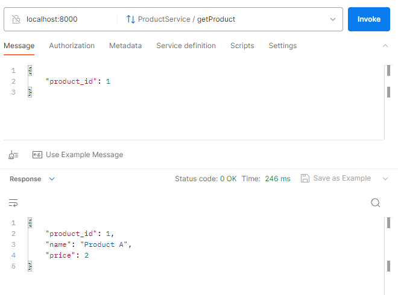

# JABC-RPC

Project consists of three modules:
1. **common** include proto files
2. **product** include server to get product
3. **order** include server to check is order available by calling product client

To generate java classes from `.proto` files run in common module:

`mvn clean package`

Product server starts on port `8000`, tomcat port is **8080**. Database can be accessed by link:
http://localhost:8080/h2-console . 

Order server starts on port **9000**, tomcat port is **8081**. 

For test purposes Postman can be used. `getProduct` call:

`createOrder` call:
